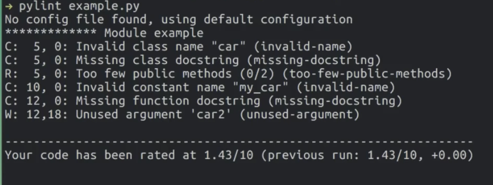

# 2. Principe de programmation Python avancé

Dans cette partie, nous allons (re)voir quelques bons principes de programmation Python, notamment pour la réalisation d'application à vocation de déploiement à grande échelle.

Nous verrons ici les enjeux sur la conception d'un code résillient, la normalisation du code, le nettoyage et le formattage du code.

Cette partie de cours a été rédigée à partir de : 
- la documentation PEP8 pour Python : https://peps.python.org/pep-0008/ (n'allez pas lire cette documentation) ;
- 

## Python & Ingénierie logicielle

### Faire un code clair

Le développement d'applications en python a connu un immense essor depuis l'explosion du Machine Learning. S'il est nécessaire d'être efficient en Mathématiques et en statistiques pour développer des modèles prédictifs de Machine Learning, Deep Learning ou d'IA, il est obligatoire d'avoir des connaissances minimums en ingéniérie logicielles pour créer un application. 

Ces enjeux sont plus opérationnels, on cherche avant tout à respecter ces enjeux :
- compréhensibilité : une équipe entière doit être capable de comprendre le code. Il faut rendre les noms de variables explicites, commenter le code et le structurer ;
- lisibilité : les normes de codage garantissent la bonne utilisation du code, ainsi que sa bonne compréhension ;
- maintenabilité : un code clair est un code facile à maintenir et à faire évoluer. Les erreurs sont rapidement corrigées, des mises à jour sont faciles à mettre en place et il n'est pas nécessaire de repenser tout le code à chaque fois ;
- documentation : faire un code commenté avec une documentation claire et explicite, qui apporte une vraie valeur ajoutée, permettent de facilement transmetter le code, de ne pas oublier ce qui a été fait et d'échanger sur le code.

L'objectif est que "n'importe qui" puisse réparer, maintenir ou améliorer un code qui a été développé par nos soins. 

### Faire un code simple

Idéalement, il faut penser nos solutions pour être le plus simple possible : pas besoin de faire des réseaux de neurones hyper complexes avec des miliers de couches quand un modèle simple à base d'arbre peut suffire. Il faut tester et tenir compte de la facilité à la mise en production, à la maintenabilité sur des cas d'usages sur lesquels une solution simple suffit. 

Quelques points de complexité qui permettent de rendre simple un code : 
- **complexité temporelle** : faire un code simple qui ne nécessite pas des miliers d'opérations inutiles, oou utiliser un code qui ne soit pas optimiser. Une refactorisation régulière peut être utile ;
- **complexité spatiale** : il faut réflechir à l'utilisation de la mémoire pour accelérer le temps de traitement et potentiellement les couts associés ; 
- **équilibre entre clarté et performance** : il faut toujours créer des outils de façon à les rendre perfomants sans pour autant rendre le code incompréhensible pour 99% des lecteurs qui pourraient intevenir sur un sujet : un arbitrage est à trouver.


## Norme de code Python : PEP8

Comme dit auparavant, il existe une convention de code qui permet d'uniformiser la création de code en python et de répondre à une partie des points listés auparavant. Cette norme s'appelle la PEP8 (Python Enhancement Proposals).

Voici quelques propositions aprticulièrement utiles :
- le code doit respecter la [snake case](https://fr.wikipedia.org/wiki/Snake_case) ;
- les lignes de code dans un script ne doivent pas dépasser 80 caractères (facilite la lisibiltié quand code sur plusieurs écrans) ;
- les fonctions doivent disposer de docstring (i.e. documentation pour les fonctions) ;
- il faut laisser uniquement dans le code des fonctions, des variables ou méthodes utilisées en pratiques...

Concrètement, cette norme est extrêmement complexe à déchiffrer si jamais vous souhaitez tout mettre en place à partir de la documentation officielle. 

En pratique, il existe des outils qui realisent un grand nombre de tests de conformité avec la norme. On peut citer PyLint, Black, Ruff... Cela donne une vision sur ce qui ne va pas dans le code et doit être corrigé...



## Notebook VS script Python 

Normalement, durant le cours de modélisation, vous avez eu à réaliser un modèle de Machine Learning dans des notebooks. Cela a été l'occasion de faire de l'exploration et de laisser des traitements désordonnés.

L'un des gros problèmes du fonctionnement est l'approche avec les cellules : on se retrouve avec des notebooks avec des centaines de traitements et cette approche ne peut être maintenue qu'à titre exploratoire. Il est donc nécessaire de passer de code dans des fichiers notebook ".ipynb" à des scripts python ".py".

L'approche fonctionnelle est extrêmement importante en python. Les cellules ne peuvent pas être laissées telles qu'elles, il faut : 
- écarter toutes les parties exploiratoires non retenues et les laisser uniquement dans un notebook documenté à titre de preuve de travail ;
- reformater les morceaux de code retenus, les transformer en fonctions python bien nommées et les compiler intelligemment sur un ou plusieurs scripts python.

## Programmation Orientée Objet

Une bonne approche pour éviter les redondances de codes est la programmation orientée objet. L'objet de ce type de programmation est de créer des "classes", c'est à dire des objets avec des caractéristiques communes (les "attributs") et disposant d'un nombre de "méthodes" , c'est à dire des fonctions pouvant être appliquées à ces élements.

Exemple :

```python 
class BankCustomer:
    """Class d'information sur un client dans sa banque."""

    def __init__(self, name:str, age_customer:int):
        """ Constructeur : initialisation des attributs de la classe"""
        self.name = name
        self.age_customer = age_customer
        self.bank_amount = 0

    def add_income(self, income_amount:int):
        """ METHODE 1 """
        self.bank_amount += income_amount

    def remove_expenses(self, expenses:int):
        """ METHODE 2 """
        self.bank_amount -= expenses

# client 1
client_one = BankCustomer("Jean", 24)
client_one.add_income(1000)
client_one.remove_expenses(500)

# client 2
client_two = BankCustomer("Carl", 51)
client_one.add_income(1400)
client_one.remove_expenses(500)
client_one.remove_expenses(300)
```

Cet exemple peut sembler basique mais il permet de se rendre compte que l'on peut synthétiser du code et appliquer directement des fonctions sur les attributs d'un objet. Cela évite par exemple de devoir définir une variable "montant_sur_le_compte" que l'on doit déplacer à chaque appel de fonction.

Concernant la data science, l'utilisation de classes spécifiques appelées Data Classes permettent de contrôler et typer les attendus d'un modèle de Machine Learning, en spécifiant les types, les champs attendus... 

Des actions plus complètes sont possibles sur la création de classes avancées ( héritages de classes, défintions de méthodes avancées...). Ces notions ne seront pas abrodées dans ce cours.

## Programmation SOLID

