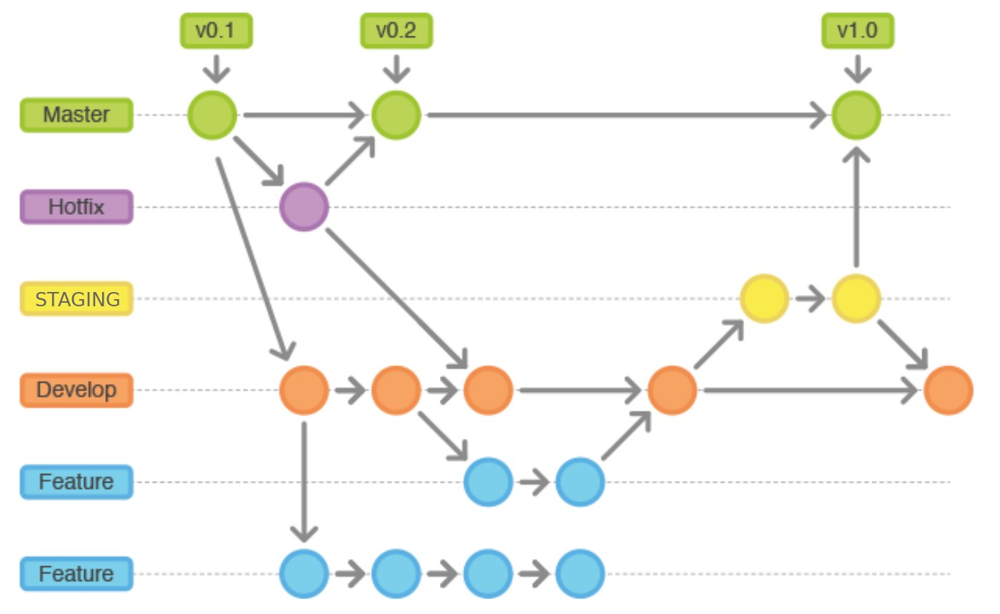
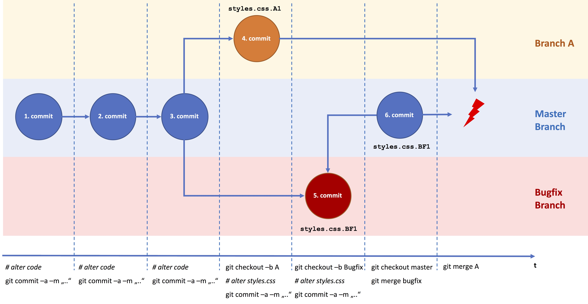

# 3. Git & GitHub : Introduction à la programmation collaborative

## Git

Git est un logiciel de gestion de versions libre, décentralisé et distribué, créé en 2005 par Linus Torvalds, auteur du noyau Linux. C'est le système de gestion le plus utilisé aujourd'hui, à tous les niveaux : grande entreprise du CAC40 comme start-up utilisent ce système.

Définissons ces trois mots : 
- **libre** : Open-Source, permet d'utiliser gratuitement le système ;
- **decentralisé** : permet à plusieurs utilisateurs de développer, en parallèle et de manière asynchrone. En fait, un dépôt distant (c'est à dire en ligne) contient de l'information à un instant T, et chaque utilisateur va actualiser le répertoire distant. Chaque utilisateur peut donc récupérer les nouvelles informations quand il veut ; 
- **distribué** : chaque utilisateur de git possède une copie du code en local sur son PC, créant ainsi un réseau possédant un ensemble de fonctionnalité commune.

*Exemple de fonctionnement simplifié :*

  

De surcroit, le système permet de garantir la sécurité et la flexibilité de ce système. Il est le moteur du système GitHub qui sera utilisé plus tard dans ce cours.

## Motivation pour utilisation

Avec les descriptions précédentes, l'utilisation de Git apparait comme une immense plus value :
- **Suivi des versions du codes** : on sait qui actualise quoi, quand et on peut faire un retour arrière si besoin ; 
- **Développement asynchrone** : pas besoin de dispo de la dernière version de l'ensemble du code pour avancer sur une nouvelle fonctionnalité ; 
- **Sécurité et flexibilité** : Git agit comme un répertoire sécurisé de stockage de codes, publics ou privés. Cela permet de garder une copie distante, organisée et sécurisée du code. A l'inverse, chaque développeur dispose d'une copie du code ainsi que de l'historique des modifications.

Avec ces justifications, cela doit suffire pour ne plus vouloir s'envoyer du code par e-mail ! ;)

## Quelques commandes de bases sur Git

Distinguons les commandes en quelques catégories. 

D'abord, les commandes liés à la récupération du dépot distant :
- `git clone` : permet de cloner le répertoire distant en local sur son environnement de travail ;
- `git fetch` : permet de comparer la version locale avec la version distante ;
- `git pull` : permet d'actualiser le code local avec les dernières modifications distantes.

Ensuite, des commandes pour ajouter du code à un répertoire distant :
- `git add` : permet d'ajouter un fichier à actualiser dans le commit (i.e dans le groupe d'incrémentation) ;
- `git commit` : permet de fixer une version d'incréments et de nommer l'itération de modifications ;
- `git status` : permet de voir les fichiers modifiés, ceux qui ont déjà été ajouté et ceux à ajouter ;
- `git push` : permet de soumettre le groupement d'incréments au répertoire distant.

En pratique, il est possible d'utiliser directement ces commandes dans un terminal git (git bash) ou d'utiliser des applications interfaçant ces fonctions en no code (GitHub Desktop, interface Git dans Visual Studio Code...).

## Branches et Nomenclatures

### Qu'est ce qu'une branche ? 

Pour faciliter l'organisation d'un projet et le développement de plusieurs fonctionnalités en parallèle sur un même projet, Git propose de séparer les développements en branche.

Une branche est en fait une copie un copie du répertoire principal, sur laquelle des développements en parallèle peuvent être fait. Cela permet de faciliter le travail en parallèle, facilite le suivi en créant des thématiques par branches et assure la stabilité de la version principale du code.

  

### Nomenclature des branches

Il est possible de regrouper les branches : on réalise un `merge`.

Pour faciliter la lisibilité dans les branches, des nomenclatures de noms permettent de s'y retrouver : 
- `master (ou main)` : branche principale, celle qui est en production. Cette branche doit être protégée par des règles directement sur les plateformes mais également par des règles au sein du groupe / écoles / entreprise ;
- `hotfix/<nom du hotfix>` : permet de réaliser des correctifs à chaud sur la production ;
- `staging` : branche d'intégration (ou pré production), réplica de la production avant passage en production ;
- `dev (ou develop)` : branche de développement, c'est celle sur laquelle on va réaliser les merges de nos nouvelles fonctionnalités pour exécuter les premiers tests aggrégés ;
- `feature/<nom de la feature>` : Permet de développer une feature selon une thématique précise.

Attention, il est possible de tomber dans un cas où il y a des `conflits` : cela signifie qu'entre deux branches, un fichier possède des développements en parallèle et la fusion n'est pas possible. Il faut gérer ces cas manuellement.

  

## GitHub

GitHub est une logiciel basé sur Git et qui permet de faciliter le développement, la création, le stockage et le partage de code.

GitHub ajoute des fonctionnalités au développement simple fait avec Git seulement, notamment l'utilisation de GitHub workflow qui permettent de faire des actions automatisées comme des tests unitaires, des déploiements en productions...

Il y a également l'ajout d'une partie communautaire à Git : on peut relever des améliorations à faire ou à faire faire au travers de `git issues`, on peut suivre des personnes ou des entreprises et voir leurs projets. 

Nous utiliserons GitHub durant le déroulé de ce projet, nous aurons l'occasion d'échanger à ce sujet par la suite.

*TIPS : Ne pas négliger le fait d'avoir un répertoire GitHub propre, notamment pour une recherche de stage / CDI : il s'agit là de votre meilleur portefeuille et témoin de capacité.*

## Quelques fichiers de référence sur Git

Pour configurer un répertoire GitHub, il existe un certain nombre de fichiers traditionnellement présent : 
- `.gitignore` : il s'agit d'un fichier de configuration qui permet de définir quels types de fichiers on ne souhaite pas ajouter sur un répertoire git (par exemple, on ne met pas de code ou de données sur un répertoire git) ;
- `LICENSE` : le fichier de license définit la license, c'est à dire les droits que l'on donne aux personnes qui souhaitent utiliser le code développé. Les permissions vont de la license MIT (license très très libre permettant quasiment toute utilisation / ré utilisation du code) à des licenses très fermées ne permettant pas la réutilisabilité ou l'utilisation commerciale ;
- `README.md` : il s'agit de la documentation du répertoire. Elle est très importante pour assurer une compréhension du sujet à n'importe qui. Il peut être utile de mettre à l'intérieur ce que fait le code, des informations techniques, le besoin à l'origine de ce sujet, les sources de données, les modes d'installation, les interlocuteurs métiers et/ou les interlocuteurs techniques, les dates... Toute information pertinente sur le projet est la bienvenue dans le readme ; 
- `requirements.txt` : plus spécifiques à Python, les fichiers de requirements sont des fichiers qui donnent les versions de packages à utiliser pour rejouer le code.