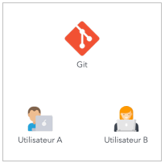

# 3. Git & GitHub : Introduction à la programmation collaborative

## Git

Git est un logiciel de gestion de versions libre, décentralisé et distribué, créé en 2005 par Linus Torvalds, auteur du noyau Linux. C'est le système de gestion le plus utilisé aujourd'hui, à tous les niveaux : grande entreprise du CAC40 comme start-up utilisent ce système.

Définissons ces trois mots : 
- **libre** : Open-Source, permet d'utiliser gratuitement le système ;
- **decentralisé** : permet à plusieurs utilisateurs de développer, en parallèle et de manière asynchrone. En fait, un dépôt distant (c'est à dire en ligne) contient de l'information à un instant T, et chaque utilisateur va actualiser le répertoire distant. Chaque utilisateur peut donc récupérer les nouvelles informations quand il veut ; 
- **distribué** : chaque utilisateur de git possède une copie du code en local sur son PC, créant ainsi un réseau possédant un ensemble de fonctionnalité commune.

*Exemple de fonctionnement simplifié :*

  

De surcroit, le système permet de garantir la sécurité et la flexibilité de ce système. Il est le moteur du système GitHub qui sera utilisé plus tard dans ce cours.

## Motivation pour utilisation

Avec les descriptions précédentes, l'utilisation de Git apparait comme une immense plus value :
- suivi des versions du codes : on sait qui actualise quoi, quand et on peut faire un retour arrière si besoin ; 
- développement asynchrone : pas besoin de dispo de la dernière version de l'ensemble du code pour avancer sur une nouvelle fonctionnalité ; 
- sécurité et flexibilité : Git agit comme un répertoire sécurisé de stockage de codes, publics ou privés. 

Avec ces justifications, cela doit suffire pour ne plus vouloir s'envoyer du code par e-mail ! ;)

## Quelques commandes de bases sur Git

## GitHub

## Branches et Nomenclatures

## Quelques fichiers de référence sur Git
    - Git 
    - Motivation à l'utilisation 
    - GitHub
    - Branches & Nommenclatures
    - Quelques commandes de base
    - Quelques fichiers à connaitre