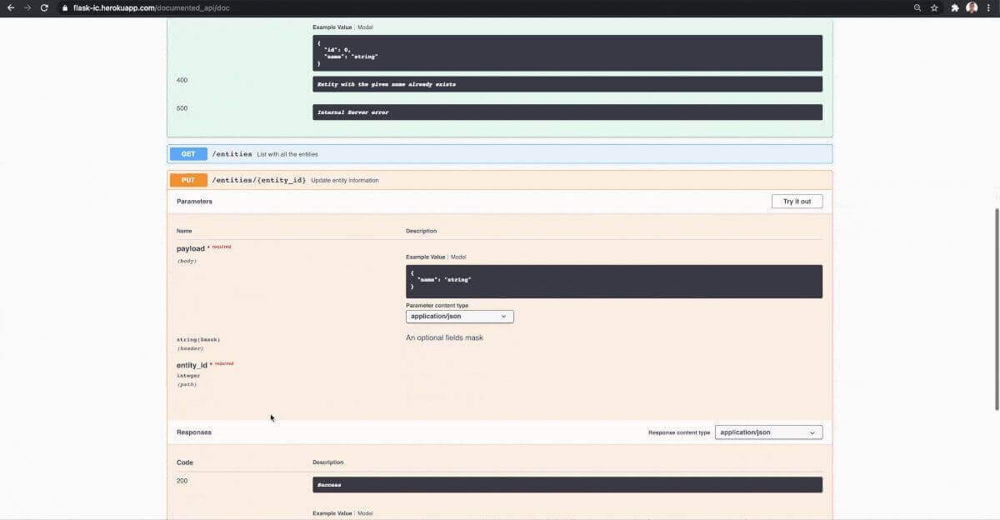

# 4. Les API en Python

## Description générique

### Késako ?

Une API (Application Programming Interface) est une interface de logicielle qui permet de connecter un logiciel ou un service à un autre logiciel.

En particulier, nous étudierons particulièrement le cas des API REST (REpresentational State Transfer). Ce sont des interfaces auxquelles on soumet des informations à un point de terminaison.

**Exemple conceptuel d'API :**

<p align="center">
  
</p>


### Fonctionnement 

Une API est composée de **routes** que l'on peut appeler (un peu comme les URL d'un site WEB). 

Ces routes peuvent être appelées avec différents types de requêtes, avec notamment :
- `GET` : requête qui ne requiert pas d'information en entrée et qui renvoie un résultat ; 
- `POST` : requête avec un input, qui va être envoyé et qui attend une réponse

D'autres types de requêtes existent mais ne seront pas abordées dans ce cours (PUT pour mettre à jour et DELETE pour supprimer).

Imaginons l'API exécutant un modèle de Machine Learning : 
- `<URL_de-l'API>/health` : requête GET, est-ce que l'application est fonctionnelle actuellement ;
<p align="center">
  
</p>

- `<URL_de-l'API>/prediction` : requête POST, réalise une prédiction avec un modèle de Machine Learning
<p align="center">
  
</p>


## Framework de développement Python

Pour développer des API en Python, il existe un grand nombre de framework utilisable possédant des forces et des faiblesses : 

| Framework                        | Forces                                                                                                                                                        | Faiblesses                                                                                                              |
|----------------------------------|---------------------------------------------------------------------------------------------------------------------------------------------------------------|-------------------------------------------------------------------------------------------------------------------------|
| **Django REST Framework (DRF)**  | - Intégré à Django, excellent pour les projets de grande envergure <br> - API riche en fonctionnalités (authentification, permissions, pagination) <br> - Supporte JSON, XML, et autres formats de réponse | - Lourd pour les petites applications <br> - Complexe pour les utilisateurs n'ayant pas d'expérience avec Django       |
| **FastAPI**                      | - Très rapide grâce à ASGI et l'utilisation de Starlette et Pydantic <br> - Documentation automatique des API via Swagger et OpenAPI <br> - Basé sur des annotations de type, facilitant la validation des données | - Relativement nouveau, moins de ressources et de tutoriels que Django <br> - Certaines intégrations avancées peuvent nécessiter des connaissances ASGI |
| **Flask**                        | - Léger et flexible, idéal pour des petites API <br> - Grande communauté et beaucoup d'extensions disponibles <br> - Facile à apprendre et à utiliser        | - Moins de fonctionnalités "prêtes à l'emploi" comparé à Django et FastAPI <br> - Pas optimisé pour les applications asynchrones sans plugins              |
| **Tornado**                      | - Conçu pour les applications asynchrones, idéal pour les API en temps réel <br> - Bonne gestion des websockets <br> - Supporte une grande charge de connexions simultanées | - Courbe d'apprentissage élevée pour les débutants <br> - Moins utilisé pour les API REST traditionnelles, donc moins de ressources disponibles |

Notons que ces frameworks utilisent la programmation asynchrone : c'est l'objet de notre prochain point.

## Programmation Asynchrone

La programmation asynchrone est une programmation qui permet d'exécuter plusieurs taches de manière concurrente et qui évite de passer du temps à exécuter une tache et à attendre la fin de celle-ci.

Il ne faut pas confondre deux taches qui s'exécutent de manière concurrente VS en parallèle : 
- en **concurrence**, on a différentes taches qui s'exécutent en simultanée ;
- en **parallèle**, il s'agit d'une seule tache qui s'exécute en plusieurs sous-tâche.

Ainsi, cette stratégie permet de maximiser la programmation et l'exécution en production de plusieurs requêtes en simultannée.

## Open API - Swagger

Un bon code résilient de production conctient une documentation complète et utilisable par un développeur.

En particulier, la création d'API avec les framexorks présentés plus haut s'accompagne d'une documentation fonctionnelle expliquant les routes qu'une application utilise. Le swagger est donc la pour décrire les fonctions implémentées, les routes pour appeler chaque fonction mais également décrire les entrées et les sorties de fonctions, particulièrement dans le cadre d'un modèle de Machine Learning.

Un swagger d'API ressemble à quelque chose comme ceci :

<p align="center">
  
</p>

## PyPI : packaging de code

Si le code développé à la suite de travaux n'est pas directement un modèle de Data Science à mettre à la disposition d'un utilisateur final, il est possible de le déployer au travers de PyPI.

PyPI (ou Python Package Index) est une plateforme Open Source en ligne d'hébergement de package de code. Du code est alors compilé, documenté et mis à la disposition d'utilisateur en ligne qui peuvent le réutiliser. 

On peut alors installer le code avec la commande :

```
pip install PACKAGE_NAME
```

Néanmoins, un code déployé dans PyPI est un code fini qui contient : 
- une documentation ; 
- un large panel de tests ;
- une gestion des versions ;
- une gestion des étapes de déploiements en ligne pour s'interfacer avec le site PyPI.

## Mise en production sans API ?

Il n'existe pas qu'une seule façon de mettre à disposition un modèle de Machine Learning.

Par exemple, pour effectuer une démonstration rapide, interfacer son modèle avec un créateur de site web local (sur la partie front) permet de rapidement présenter et mettre à disposition un modèle.

En parallèle, l'utilisation d'un modèle au travers d'une API est particulièrement adapté dans le cas d'une utilisation ponctuelle régulière. Un code devant s'exécuter une seule fois par jour peut être effectuée via un "batch", qui peut être mis en production avec un CRON (linux) ou un TASK SCHEDULER (Windows).
