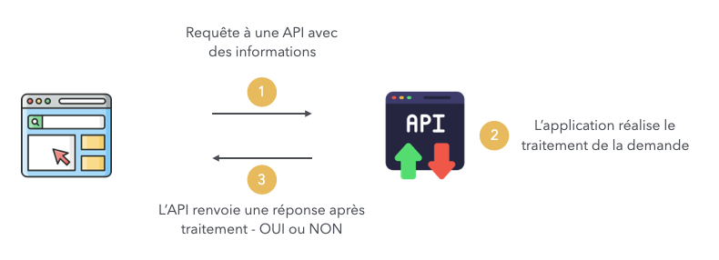
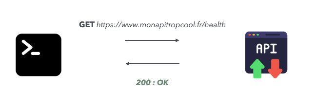
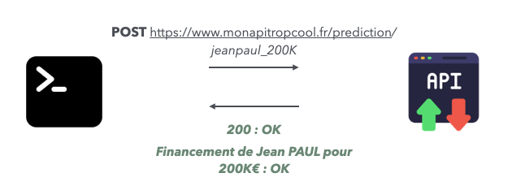

# 4. Les API en Python

## Description générique

### Késako ?

Une API (Application Programming Interface) est une interface de logicielle qui permet de connecter un logiciel ou un service à un autre logiciel.

En particulier, nous étudierons particulièrement le cas des API REST (REpresentational State Transfer). Ce sont des interfaces auxquelles on soumet des informations à un point de terminaison.

**Exemple conceptuel d'API :**

  

### Fonctionnement 

Une API est composée de **routes** que l'on peut appeler (un peu comme les URL d'un site WEB). 

Ces routes peuvent être appelées avec différents types de requêtes, avec notamment :
- `GET` : requête qui ne requiert pas d'information en entrée et qui renvoie un résultat ; 
- `POST` : requête avec un input, qui va être envoyé et qui attend une réponse

D'autres types de requêtes existent mais ne seront pas abordées dans ce cours (PUT pour mettre à jour et DELETE pour supprimer).

Imaginons l'API exécutant un modèle de Machine Learning : 
- `<URL_de-l'API>/health` : requête GET, est-ce que l'application est fonctionnelle actuellement ;

  

- `<URL_de-l'API>/prediction` : requête POST, réalise une prédiction avec un modèle de Machine Learning

  

## Framework de développement Python

Pour développer des API en Python, il existe un grand nombre de framework utilisable possédant des forces et des faiblesses : 

| Framework                        | Forces                                                                                                                                                        | Faiblesses                                                                                                              |
|----------------------------------|---------------------------------------------------------------------------------------------------------------------------------------------------------------|-------------------------------------------------------------------------------------------------------------------------|
| **Django REST Framework (DRF)**  | - Intégré à Django, excellent pour les projets de grande envergure   - API riche en fonctionnalités (authentification, permissions, pagination)   - Supporte JSON, XML, et autres formats de réponse | - Lourd pour les petites applications   - Complexe pour les utilisateurs n'ayant pas d'expérience avec Django       |
| **FastAPI**                      | - Très rapide grâce à ASGI et l'utilisation de Starlette et Pydantic   - Documentation automatique des API via Swagger et OpenAPI   - Basé sur des annotations de type, facilitant la validation des données | - Relativement nouveau, moins de ressources et de tutoriels que Django   - Certaines intégrations avancées peuvent nécessiter des connaissances ASGI |
| **Flask**                        | - Léger et flexible, idéal pour des petites API   - Grande communauté et beaucoup d'extensions disponibles   - Facile à apprendre et à utiliser        | - Moins de fonctionnalités "prêtes à l'emploi" comparé à Django et FastAPI   - Pas optimisé pour les applications asynchrones sans plugins              |
| **Tornado**                      | - Conçu pour les applications asynchrones, idéal pour les API en temps réel   - Bonne gestion des websockets   - Supporte une grande charge de connexions simultanées | - Courbe d'apprentissage élevée pour les débutants   - Moins utilisé pour les API REST traditionnelles, donc moins de ressources disponibles |

Notons que ces frameworks utilisent la programmation asynchrone : c'est l'objet de notre prochain point.

## Programmation Asynchrone

La programmation asynchrone est une programmation qui permet d'exécuter plusieurs taches de manière concurrente et qui évite de passer du temps à exécuter une tache et à attendre la fin de celle-ci.

Il ne faut pas confondre deux taches qui s'exécutent de manière concurrente VS en parallèle : 
- en **concurrence**, on a différentes taches qui s'exécutent en simultanée ;
- en **parallèle**, il s'agit d'une seule tache qui s'exécute en plusieurs sous-tâche.

## Open API - Swagger

## PyPI : packaging de code

## Mise en production sans API ?

4. API : Création d'une application en Python
    - Définition & motivation
    - Framework de développement Python 
    - Programation Asynchrone
    - Open API (ou Swagger)
    - PyPI : packaging de code
    - Mise en production sans API ?
