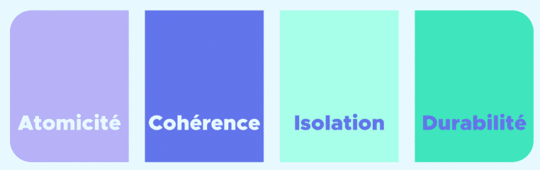

# 5. Bases de données et infrastructure applicative

## Bases de Données

Les API ne sont pas les seuls systèmes qui peuvent se retrouver en production, les bases de données sont également une des applications la plus importante (si ce n'est la plus importante) pour un ouvrier de la data. 

### Type de bases de données

Une base de données est un système de stockage d'informations.

On distingue deux familles de bases de données majeures en informatique, les bases de données relationnelles et non relationnelles. 

#### Bases de données relationnelles 

Les bases de données relationnelles sont les bases de données classiques, structurées, dans lesquelles les informations sont stockées dans des tables. Les tables sont un regroupement d'entité, et chaque **ligne** de la table représente une itération de cette entité. L'entité est caractérisée par des informations sous forme de **colonnes** appelées attributs.

  

Ce type de bases est particulièrement utilisé dans le domaine bancaire et assuranciel : stockage de l'historique des crédits, des contrats, des informations personnelles des clients...

On utilise le SQL (Structured Query Language) pour manipuler les informations dans les bases de données. 

Dans une base de données relationnelle, le schéma de la table est défini à l'avance (on connait les noms des attributs de la table) et les lignes sont identifiées de manière unique par une clé nommée **clé primaire**. Il est possible de rapprocher les lignes de différentes tables en faisant une jointure.

Les opérations dans les bases de données relationnelles doivent respecter le schéma ACID : 
- **Atomique** : chaque opération doit être accomplie jusqu'à son terme pour être considérée. Si une étape est arrêtée en plein milieu (perte de connexion), elle ne doit pas être présente ;
- **Cohérence** : on s'assure que les données présentes ne présentent pas d'incohérence en leur sein. S'il y a une incohérence dans la table, une version précédente doit être restaurée ;
- **Isolation** : chaque opération doit être effectuée unitairement, c'est à dire une seule transaction à la fois. Cela peut créer quelques lenteurs, mais cela permet d'assurer qu'il n'y a pas d'interaction qui s'impactent entre elle ;
- **Durabilité** : chaque changement dans la base de données doit être permanant.

  

Quelques exemples de Framework utilisant des bases de données relationnelles : MySQL, PostgreSQL, Oracle Database, Microsoft SQL Server, SQLite.

*POUR ALLER PLUS LOIN* : quelques idées de thématiques autour des bases de données qui peuvent être intéressantes pour préparer un entretien complexe : principe de l'indexation dans les bases de données, optimisation des requêtes, normalisation des bases de données, administration et sécurisation des bases de données...

#### Bases de données non relationnelles

Les bases de données non relationnelles sont des bases sur lesquelles aucun schéma n'est imposé. On peut stocker tout type de document en gardant un minimum de structure (ce n'est pas non plus un google drive sur lequel on met tout son bazar).

On peut trier les fichiers dans les bases de données selon différents types : 

|Type | Description courte | Exemple|
|------|-----------|------------------|
|🗂️ Documentaire | Stocke des documents JSON/BSON | MongoDB, CouchDB|
|🔑 Clé-Valeur | Stocke des paires clé/valeur simples | Redis, DynamoDB|
|🧮 Colonne | Stocke par colonne, pas par ligne | Cassandra, HBase|
|🔗 Graphe | Relations sous forme de graphes (nœuds/liens) | Neo4j, ArangoDB|

Ce type de stockage permet une optimisation de certains types de requêtes et d'ajouter une flexibilité. Par exemple, si les formats des données sont amenés à changer et à être actualiser, comme les schémas ne sont pas définis à l'avance, on peut se permettre certaines largesses.

Attention : ce schéma ne respecte pas toujours les contraintes ACID, ce qui peut causer des problèmes.

Quelques exemples de Framework utilisant des bases de données non relationnelles : MongoDB, Neo4j, Redis...

## Environnements & Motivations

### Quels types d'environnement ? 

En Machine Learning, les ingénieurs qui réalisent des travaux de Machine Learning travaillent sur différents environnements (sur leur ordinateur en local, sur leur modèle...).

On distingue deux types d'environnement :
- des environnements de développement, sur lequel les développeurs peuvent faire tout un tas d'essai. Ces environnements peuvent être sur leur machine ou être des "bacs à sable" en ligne, sur un cloud par exemple ;
- des environnements de productions, qui sont des environnements sur lesquels on n'y a pas vraiment de sandobox. Ils servent à accueillir des projets matures, comme des API.

En pratique, une grande liberté est laissée sur la partie environnement de développement. L'idée est de garder une trace de la construction de l'environnement qui a été construit pour pouvoir le reocnstruire ailleurs (par exemple, quel système d'exploitation, quelle version de Python, quels packages ont été installés et dans quelles versions...)

### A propos des environnements de production...

Les environnements de production sont généralement divisés en 4 parties et dans cet ordre : 
- **Environnement de développement** : c'est le premier, il sert à accueillir l'application et permet au développeur (Data Scientist ou Machine Learning Engineer) de déployer une première version et d'y effectuer quelques tests ;
- **Environnement de recette (ou R7)** : c'est l'environnement sur lequel l'ensemble des tests permettant de valider l'application doivent être faits. Une partie dédiée au testing est proposée dans la partie 8. Ces tests peuvent être directement réalisés par le développeur ou bien par une équipe dédiée au testing ;
- **Environnement de pré-production** : cet environnement sert à vérifier certains aspects fonctionnels de l'application, toujours avec quelques tests. Normalement, cet environnement n'est plus laissé à la main des développeurs, c'est un OPS qui s'en occupe ;
- **Environnement de production** : c'est l'environnement final de l'application. L'application y est déployée dans son état final, et c'est elle qui est utilisée par les utilisateurs finaux.

Le graphique ci-dessous récapitule les environnements. Une application passe par tous ces environnements, et on ne passe à l'environnement suivant que quand on a les garanties sur les tests passés.

  

## Architecture on-premise VS Cloud

Les environnements présentés précédemment peuvent être présents sur deux types d'environnement : on-premise et sur le Cloud.

### Architecture on-premise

Le premier type d'architecture est l'architecture on-premise. Cette architecture s'appuie sur des serveurs locaux, gérés par les entreprises. L'ensemble de la repsonsabilité (disponibilité des serveurs, sécurité, scalabilité, mise à jour) est géré par l'entreprise propriétaire des serveurs.

Ce système possède un coût d'entrée élevé : il faut s'équiper en Hardware mais aussi en humain capable de mettre en place, maintenir et gérer ces systèmes. Par contre, l'ensemble de la gouvernance est à l'entreprise et cela assure une plus grande maitrise : pas d'augmentation de coûts surprise, maitrise du chemin de transit des données.

### Architecture Cloud

L'autre solution majoritaire est le système s'appuyant sur le cloud : la responsabilité hardware est déléguée à une entreprise tierce et une partie des opérations sont déléguées. La sécurité, la scalabilité et la gestion et maintenance sont entièrement à la responsabilité de l'entreprise tierce. Pour contre, il faut se plier aux contraintes de l'entreprise : 
- gestion de la gouvernance du transit des données ;
- coûts de license ;
- mise à jour des systèmes à prevoir.

On distingue trois acteurs majeurs se partageant le gros du marché :
- Microsoft Azure ;
- Google Cloud Plateform (GCP) ;
- Amazon Web Service (AWS) ;

Ces trois acteurs sont des géants américains, et le système américain fait que certaines lois / règles s'appliquent sur les données françaises (droit de consultation des données par le gouvernement américain). C'est pourquoi des acteurs européens s'appliquent pour concurrencer ces entreprises : OVHcloud (🇫🇷), T-Service (🇩🇪).

