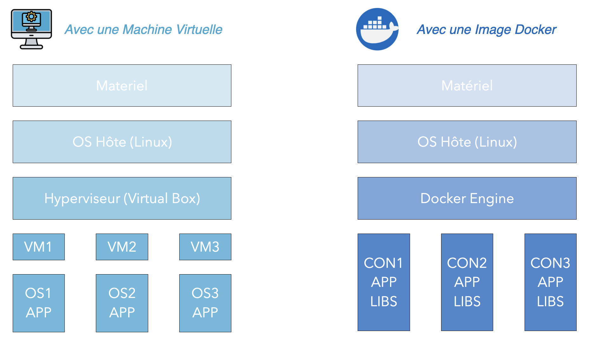
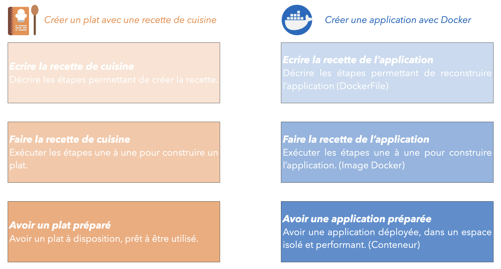

# 06. Docker

## Notre application existe - et puis quoi ? 

A ce stade, notre application existe en local sur notre ordinateur mais elle n'est pas en ligne. On a vu que l'on peut avoir une multitude d'environnements qui ont différents rôles, et sur différentes couches physiques. Il faut donc la déployer.

## Docker - Kesako ? 

Docker se présente comme un outil de virtualisation : il permet de créer, déployer et exécuter des applications sous la forme **d'image docker** dans un espace isolé appelé **conteneur**.  

L'utilisation de Docker est différente d'une machine virtuelle (VM). On peut résumer le fonctionnement sous la forme du schéma suivant.

<p align="center">
  
</p>

Un système avec des machines virtuelles est ordonnancé avec un hyperviseur : il gère les ressources de chacune des machines virtuelles. Sur le système avec Docker, le docker engine occupe ce rôle.

La grosse différence est sur le déploiement de chacun des environnements :
- Dans le système avec des machines virtuelles, chaque machine virtuelle possède son propre environnement. Cela signifie que chaque machine possède son propre OS, ce qui crée des lourdeurs sur les applications, du temps de redémarrage assez long et une portabilité assez limitée ;
- A l'inverse, le système avec Docker est plus performant car chaque application partage le même OS avec toutes les autres. Chaque container n'a donc que son application et ses librairies à installer, tout le reste est déjà prêt.

Pour résumer, les VM sont lourdes car elles prennent un OS complet et consomment beaucoup de ressources. Docker se veut être un système plus léger, robuste et performant et qui répond à la contrainte : 

<center><b>Le code marche sur mon ordinateur mais pas en production...</b></center>

## Fonctionnement et commandes de base sur Docker

### Description de l'image

La première étape pour déployer une application en utilisant Docker est la création de l'image docker. L'idée est de créer un modèle figé de l'application avec :
- le code ;
- les dépendances ;
- les fichiers de configuration ;
- un OS de base : léger, en général il s'agit d'un OS linux allégé (Débian, Alpine).

Ensuite, on déploie l'image dans un conteneur. Un conteneur est une unité légère, portable et indépendante qui porte l'ensemble de ce qui est nécessaire pour faire fonctionner une application : code, bibliothèque, dépendances, variables d'environnements...

### Création d'image avec du code

Il est possible de comparer la création d'une application à une recette de cuisine.

<p align="center">
  
</p>


D'abord, il faut créer un fichier nommé DockerFile, qui est en fait les différentes étapes à exécuter pour créer l'image docker. Le fichier ressemble à ceci : 

```dockerfile
# choose a root image to install python
FROM python:3.10-alpine

# define a work folder
WORKDIR /app

# installation of dependencies
RUN pip install poetry && poetry config virtualenvs.create false && poetry install

# expose port
EXPOSE 8000

# run an API
CMD ["uvicorn", "api:app", "--host", "0.0.0.0", "--port", "8000"]
```

Une fois que le Dockerfile est écrit, il est possible de créer l'image Docker :

```console
zachariebuisson@github_app_repo:~$ docker build -t mon_app .
```

Ensuite, on peut lancer l'image Docker créée dans un conteneur en local avec la commande :

```console
zachariebuisson@github_app_repo:~$ docker run mon_app
```

D'autres commandes existent : arrêter le conteneur, consulter la liste des conteneurs actifs, etc.

Pour se passer du terminal, des solutions low code permettent d'interagir avec l'ensemble de l'infrastructure Docker : Docker desktop (payant) et PodMan (open source) font office de favoris sur ces sujets. 

## Répertoire d'images

Il existe des sites qui permettent de stocker les images Docker en les déposant en ligne pour y accéder depuis un environnement non local.

Voici les principaux sites pour déposer des images :
- DockerHub :
- GitHub Container Registry (GHCR) ;
- Amazon ECR (Elastic Container Registry) ;
- Google Artifact Registry (anciennement GCR) ;
- Azure Container Registry (ACR) ;
- Quay.io.

## Mon conteneur peut être en ligne, et maintenant ? 

Maintenant que l'application est prête à être mise dans un conteneur, que notre conteneur est prêt en local, voire même en ligne, il faut configurer l'application. 

Un certain nombre de contraintes n'ont pas encore été adressées à ce stade : 
- quelle est l'URL de l'application ? 
- quelle partie de l'API est disponible ? 
- comment suivre l'état de fonctionnement de l'application ? 
- comment gérer un flux un important d'utilisateur ? 

Ces questions peuvent être configurées dans des fichiers de configuration, qui vont configurer l'orchestration des conteneurs.
