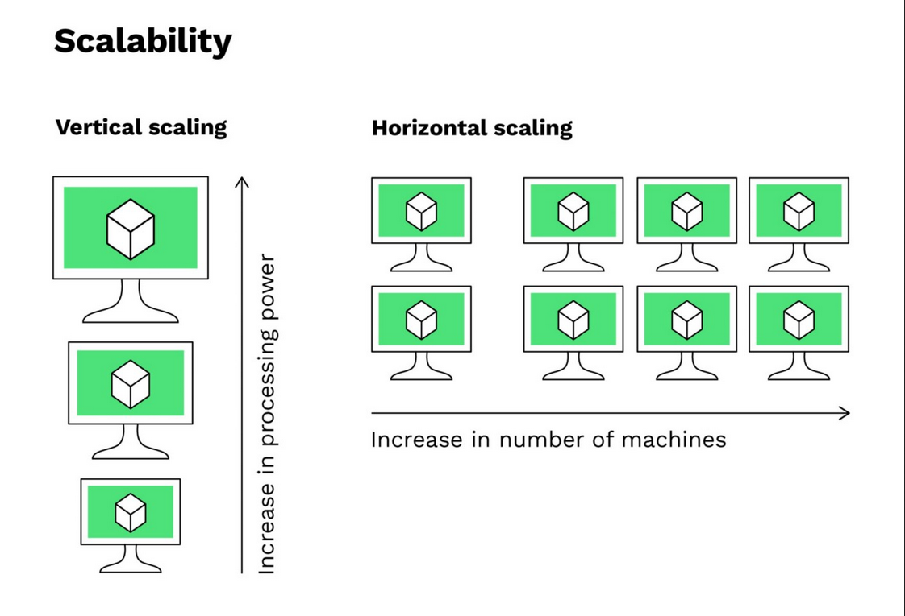

# 7. Kubernetes

*DISCLAIMER : Cette partie est objectivement la partie la plus difficile du cours et probablement celle sur laquelle on travaillera le moins. En pratique, les Data Scientist sont accompagnés sur cette partie, mais il est quand même toujours utile de garder les grandes lignes du fonctionnement en tête, car ce sont à minima des choses qui peuvent être demandées en entretien, puis utilisées dans le travail au jour le jour.*

## Qu'est ce que Kubernetes ?

### Description générale

Kubernetes est un système open source d'orchestration de conteneurs. Avec cet outil, il est possible de gérer le déploiement, la vie de l'application, sa mise à l'échelle et de surperviser les applications. 

Il est notamment utilisé pour :
- Faciliter la gestion d’applications distribuées ;
- Répartir la charge automatiquement (load balancing) ;
- Redémarrer les conteneurs en échec ;
- Déployer des mises à jour sans interruption (rolling updates).

Kubernetes se divise en deux parties majeures : 
- **un plan de contrôle** (control plan) : il prend les décisions d'orchestration, comme où déployer l'application, quand redémarrer le cluster... Les composants majeurs du plan de contrôle sont : 
    - `kube-apiserver` : le point d'entrée de l'API ;
    - `kube-scheduler`: décide ou placer les conteneurs ;
    - `kube-control-manager`: surveille l'état global des unités.
- **des noeuds** : les noeuds exécutent les conteneurs.

### Principe de fonctionnement

Les unités de base de Kubernetes sont appelés des "pods". Ces pods peuvent contenir un ou plusieurs conteneurs, partageant certaines caractéristiques communes (IP commune, espace de stockage commun). Ces unités sont conçues pour être éphémères : si le pod plante, Kubernetes le redémarre.

Pour savoir comment configurer les pods et l'ensemble du service, on définit un fichier de configuration nommé "deployment". Ce fichier donne les critères de l'application, avec par exemple :
- `replicas` : combien de pods je veux en vie en même temps pour assurer que mon application soit dans un état permettant une utilisation correcte ? 
- `LivenessProbe` : tous les combiens de temps je dois tester l'application ? 
- `scaling` : dois-je augmenter le nombre de pods pour accepter plus de charge ? 

On définit ensuite un fichier nommé "service". Il s'agit d'une abstraction réseau, qui expose un ou plusieurs pods, en donnant une IP et DNS. Pour exposer l'application à des services externes (par exemple, hors de l'infrastructure de l'entreprise sur une architecture on-premise), on utilise un "ingress", qui va gérer l'accès HTTP depuis l'externe.

D'autres types de fichiers peuvent encore être inclus, comme les ConfigMap pour stocker des données de configuration non sensibles (URL, chemin) et les Secrets pour stocker les informations sensibles (ID, MDP).

## Scaling Horizontal VS Scaling Vertical

Dans le développement logiciel, il est important d'allouer des ressources à une application selon son nombre d'utilisateurs. Il existe deux manières d'ajouter de la capacité pour une application à augmenter sa capacité de prise d'activité :
- `scaling vertical` : il s'agit de la méthode la plus simple et la plus naïve. On cherche à augmenter la taille hardware de la machine sur laquelle l'application tourne : augmentation du nombre de CPU, de GPU, ajout d'un disque SSD plus performant... Cette méthode est facile à mettre en oeuvre mais est limitée par des réalités physiques ;
- `scaling horizontal` : cette méthode consiste à ajouter + de machines pour répartir le travail. Cela passe par un ajout de serveurs, la replication des bases de données, un load balancing pour repartir correctement les requêtes... Cette approche est plus flexible et limite les problèmes de disponibilités, mais est plus complexe à gérer.

Cette approche fonctionne tant avec une approche machine qu'avec Kubernetes, comme on peut le voir si dessous.

<p align="center">
  
</p>

## Redondance, maintenance et persistance

Trois points importants de l'utilisation de Kubernetes, à garder en tête, sont la redondance, la maintenance et la persistance.

### Redondance

La redondance est probablement le plus important des trois points. L'idée de la redondance est de se mettre à l'abri d'une rupture de service (SPoF – Single Point of Failure) en créant plusieurs replicas de l'application.

Dans Kubernetes, cela se matérialise par des ReplicaSets, gérés dans le fichier de déploiement. Cela assure qu'il y ait toujours un nombre de pods minimums en vie.

```yaml
spec:
  replicas: 3
```

Le load balancing, i.e. la gestion de la repartition des demandes, est géré automatiquement par Kubernetes. Elle est pas belle la vie ? 

### Maintenance

La maintenance se concentre autour des opérations nécessaires pour mettre à jour, corriger, ou faire évoluer une application sans impacter le service.

Par exemple, pour faire une mise à jour, Kubernetes va progessivement mettre à jour les pods, un à un, maintenant l'activité : c'est le **rolling update**, avec des **rollbacks** en cas d'échec.

```bash
kubectl rollout restart deployment mon-app
```

### Persistance

En théorie, les pods dans Kubernetes ne sont pas persistants. Cela veut dire que si le pod est éteint, des informations créées et stockées après la création du pod, dans le pod, seront perdues.

Par contre, il est possible de forcer la persistance dans les stockages avec des PersistantVolume. Cela provisionne un espace de stockage dans le cluster et permet d'écrire dans le cluster des informations.


```yaml
apiVersion: v1
kind: PersistentVolumeClaim
spec:
  accessModes:
    - ReadWriteOnce
  resources:
    requests:
      storage: 5Gi
```
