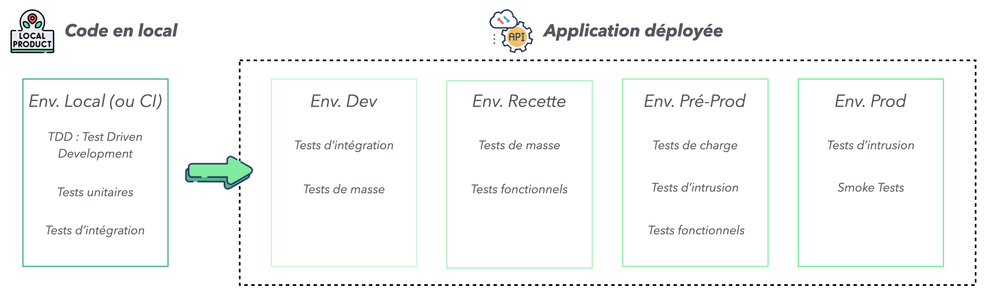
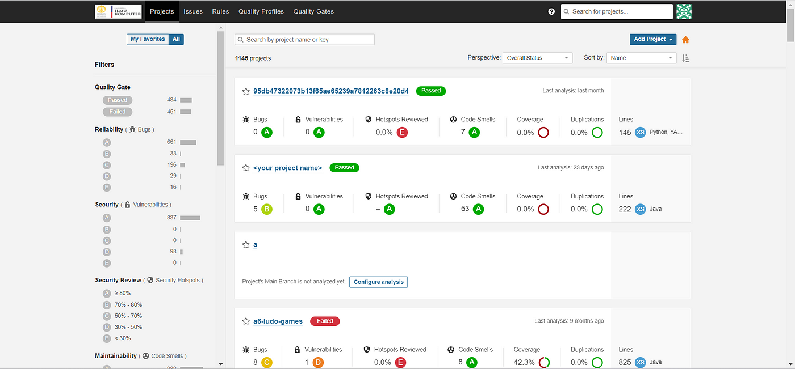
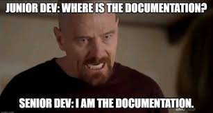

# 8. Continuous Integration (CI)

## Qu'est ce que l'intégration continue ?

L'intégation continue est une façon d'intégrer de manière automatique dans une application l'ensemble des modifications dans le code. Intégrer les étapes au fur et à mesure dans une application permet de : 
- **détection anticipée des erreurs** : des tests unitaires précoces, exécuter à chaque étape d'une évolution du code, permettent de détecter des erreurs et des regressions ;
- **améliorer la qualité du code** : des analyses automatiques du code écrit permettent de dire si le code est de bonne qualité et comment l'optimiser ;
- **faciliter la collaboration entre collaborateurs** : l'intégration continue permet aux développeurs de travailler sur le même code en temps réel, ce qui facilite la collaboration et la communication entre les membres de l'équipe ;

En pratique, le fonctionnement d'une CI est en général le suivant : 
1. Un développeur pousse du code vers un dépôt Git (par exemple sur GitHub) ;
2. Un outil de CI (GitHub Actions) se déclenche automatiquement sur condition ;
3. Il exécute une pipeline CI : cela peut inclure la compilation, les tests, l’analyse de code, etc ;
4. En cas d’échec, les développeurs sont alertés rapidement.

Pour réaliser une intégration continue, après avoir choisi un système pour la réaliser (github action, azure pipeline...), on peut mettre en place un ensemble d'analyses dans la CI pour faire ces actions :
- tests automatiques ;
- analyse de qualité de code ;
- analyse de vulnérabilité.

## A propos du testing 

Le testing est l'un des points les plus importants dans le développement, et particulièrement en Machine Learning.

On va distinguer quelques types de tests :
- Tests unitaires ;
- Tests d’intégration
- Tests de masse ;
- Tests fonctionnels / de validation ;
- Tests d'intrusion ;
- Tests de charge.

L'ensemble des tests réalisés doit être traqué dans un cahier de tests : on note ce qui a été fait (quel type de tests et quels tests en leurs seins), ce qui était attendu et ce que l'on a obtenu, ainsi que la validation.

### Tests unitaires

Le premier test que l'on devrait avoir dans la réalisation d'un code est le test unitaire. Normalement à ce stade, nous avons compris l'importance de rédiger du code au travers de scripts python, organisés en fonction et en classes.

Le test unitaire est un test qui permet de vérifier unitairement le fonctionnement de chaque fonction / classes et méthodes dans un script Python. On réalise différents types d'opérations : 
- test de cas "classiques", sur lequel l'utilisateur peut quasiment deviner le résultat a priori et la génération du code permet de confirmer ce résultat ;
- cas limites de fonctions : jeux de données vides, fonctionnement correct avec des valeurs non prévues / aberrantes...

Ce fonctionnement peut se faire en même temps que le développement de fonctions, pour s'assurer que les résultats des fonctions soient les bons, voire même avant les fonctions : ce mode de développement s'appelle le TDD (Test Driven Development).

Les deux principaux outils pour faire des tests unitaires sont PyTest et Unittests. 

Ces tests sont à faire avant le déploiement de l'application en développement, et être intégré dans une CI.

### Tests d’intégration

Ces tests sont des tests assez basiques qui ont pour but de tester l'interraction de chaque composant les uns avec les autres. En particulier, on peut faire un test de bout en bout pour faire en sorte de voir si, du début à la fin d'un processus, on a le résultat attendu. 

Ces tests sont faits soit avant le déploiement en développement, soit en développement.

### Tests de masse

Les tests de masse sont essentiels dans le développement logiciel. Pour réaliser des tests de masse, il suffit de prévoir un grand nombre d'exemples à tester dans une application, et on regarde les sorties pour évaluer un fonctionnement macro correct. 

Par exemple, si on prend le cas d'une API, un déploiement dans un environnement de recette et quelques milliers d'appels avec des données permettent de mettre en évidence un bon fonctionnement macro des attendus : nombre de retours positifs de l'API et cas en erreur non détectés auparavant, volume de classes prédites...

Faire cet exercice avec quelques cas pour tester un bon fonctionnement peut toujours servir.

Ces tests sont à faire en développement et / ou en recette.

### Tests fonctionnels / de validation

Ce test a pour but de vérifier que l'application fait ce que le cahier des charges de l'application demande. Pour cela, on regarde sur un ensemble de requêtes si l'attendu est exactement le bon.

Ce test est à faire en recette et / ou en pré-production.

### Tests d'intrusion (ou PenTests)

Les tests d'intrusion sont des tests qui doivent mettre en avant des failles de sécurité. En principe, ces tests vont regarder les différents vulnérabilités de cyber-sécurité et permettent de mettre en place une protection sur des attaques usuelles.

Ces tests sont assez peu laissés à la main des DataScientists ou autres, ils sont soit laissés à la charge des équipes cyber-sécurité, soit à la main de prestataires externes experts et spécialisés dans le domaine. 

Ces tests sont à faire en pré-production.

### Tests de charge

Les tests de charge fonctionnent comme les tests de masse, mais n'ont pas le même objectif. Ils ont pour objectif de confirmer que l'application est dimensionnée à reçevoir le volume de demandes attendues en production. 

Par exemple, le service Twitter reçoit XXX demandes par jour, il faut donc être sur que l'application soit capable de tenir. On doit donc pouvoir répliquer ce volume en environnement ante prod.

Ces tests sont à faire en pré-production.

<p align="center">
  
</p>

## Evaluation automatique de la qualité du code

### Qu'est ce qu'un code de qualité ? 

Un code de qualité en python est un code qui : 
- est simple (on n'ajoute pas de la complexité inutile pour "prouver") ;
- est documenté (cf. image ci dessous); 
- respecte les normes et conventions du langage.

En pratique, si vous respecter les trois points ci-dessus, 99% des développeurs vous remercieront et vous pourrez collaborer à des projets d'envergures sans soucis.


*Remarque : on peut ajouter en quatrième point de qualité "est modulaire". Un code qui peut être réalisé à de grandes chances de respecter les trois points précédents, mais inclut d'autres contraintes : il est sous forme de classe, générique et traite différents cas conditionnellemment. Par contre, tous les codes n'ont pas comme but d'être modulaire.*

### Comment évaluer la qualité d'un code automatiquement

Différents packages Python inclus une analyse de la qualité du code : 
- Pylint : outil d'analyse générique ;
- Ruff : outil d'analyse génrique, écrit en Rust et plus performant ;
- Black : formatteur de codes selon la PEP8 ;
- Isort : formatteur d'imports de packages.

On a déjà parlé de ces packages auparavant. 

Il faut juste savoir que l'on peut intégrer les appels à ces packages dans une CI.

```yaml
      - name: Install dependencies
        run: |
          python -m pip install --upgrade pip
          pip install poetry 
          poetry install 
      
      - name: Run flake8
        run: poetry run flake8 .
      
      - name: Check formatting with black
        run: poetry run black --check . --line-length 79
      
      - name: Check imports with isort
        run: poetry run isort . --check-only
      
      - name: Run pylint
        run: poetry run pylint . --fail-under=9
```

### Vers une approche exhaustive de l'analyse

Il existe des systèmes et des applications qui permettent de faire une analyse complète des applications, d'un point de vue de la qualité du code, mais aussi pour faire de la détection d'erreurs dans le code, de vulnérabilités...

L'un des plus connu s'appelle Sonar. L'interface ressemble à celle-ci :

<p align="center">
  
</p>

On peut voir qu'il évalue l'ensemble des points mentionné ci-dessus. Si cela ne respecte pas une certaine note, ou s'il y a une quantité qui est trop basse, le scan est en échec et l'application est considérée comme d'insuffisante qualité.

## Build Automatique d'image

De la même manière que les tests et la qualité de code automatique, il est possible d'automatiser la création d'une image Docker dans la CI.

En fait, il sufit de jouer les commandes de création de l'image (docker buil, docker run...) dans un fichier de configuration afin d'avoir une image créée.

```yaml
      - name: Build Docker image
        run: docker build -t mon_app:version .

      - name: Run Docker container
        run: docker run -d -p 8000:8000 mon_app:version
```

## Construction de documentation automatique

Enfin, l'une des dernières choses qui peut être incluse dans une CI et qui a une vraie valeur ajoutée est une documentation automatique.

Cette partie sur la CI étant déjà assez longue, nous ne rentrerons pas trop dans le détail. 

Néanmoins, le framework Sphinx, en python, permet de rédiger des documentations automatiques et répond à un grand nombre de contraintes : documentation technique et affichage de docstring like dans une page web auto générée, explication conceptuelle de package...

<p align="center">
  
</p>
