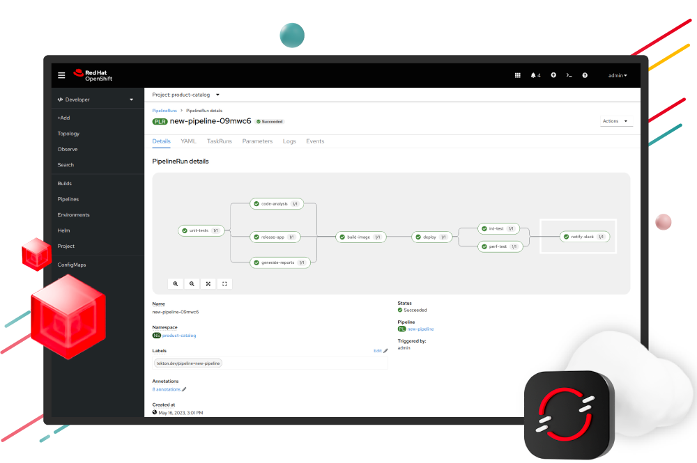
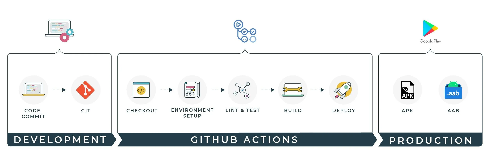

# 9. Continuous Deployment

## Qu'est ce que le Déploiement Continu ? 

### Définition

Le déploiement continu consiste à déployer une application en production dès lors que la CI est correcte, c'est à dire en ayant les tests validés, un code correct syntaxiquement...

En fait, derrière CD, il peut y avoir deux significations : 
- **Continuous Delivery** : le code est prêt à être déployé, mais le déploiement est manuel ;
- **Continuous Deployment** : le code est automatiquement déployé sans validation humaine.

### Avantages du CD

Les avantages à livrer un code en production dès que des tests sont réussis sont nombreux :
- on peut itérer rapidement, et beaucoup d'entreprises souhaitent accélérer la mise en production ;
- moins d'erreurs humaines : on limite le risque d'anomalies par la CI et la CD se déclenche directement, l'humain ne peut pas rajouter sa petite touche entre temps.

### Limite du CD

En revanche, le CD repose sur des processus parfaitement rodés : la surveillance doit être maximale, particulièrement s'il y a des déploiements sans aucune vérification humaine. 

Une équipe dédiée doit être prête à faire machine arrière si jamais il y a un problème entre temps. 

<p align="center">
    
</p>
<center><i>Ce que ne doit pas être une pipeline de CD...</i></center>

## Quand prévoir un déploiement automatique ?

La grande question est de savoir quand prévoir un déploiement automatique dans le cadre d'un modèle de Machine Learning.

On peut se donner quelques exemples : 
- quand un modèle passe en dessous d'une performance minimum : on peut ré-entrainer un modèle sur des données récentes, changer l'infrastructure et déployer automatiquement un modèle au besoin ; 
- quand les données driftent : on peut se dire que le contexte des données peut changer dans le temps et ainsi, quand les données changent, le modèle perd en efficacité ; 
- quand un modèle en phase de tests est correct : si on met en place un testing sur un modèle, pour vérifier l'efficacité d'un modèle entre une version 1 et 2, on peut déployer le modèle v2 s'il est correct et efficace automatiquement.

La CD est donc particulièrement adaptée à des modèles qui doivent être surveillés, mais aussi sur des modèles qui changent beaucoup (modèles de recommandations, modèles de ranking...).

## Combiner CD et Kubernetes

Il est possible (souhaitable) de combiner l'utilisation de la CD avec Kubernetes. Pour cela, on a une pipeline de CI/CD qui crée une image et la déploie sur le repertoire d'images, et d'inclure dans la CD des commandes permettant d'aller récupérer cette image automatiquement dans les fichiers de configuration.

```yaml
- name: Deploy to Kubernetes
  run: |
    kubectl apply -f k8s/deployment.yaml
    kubectl apply -f k8s/service.yaml
```

## Quelques outils de CD : ArgoCD, Red Hat Openshift, GitHub Actions

On peut lister quelques outils de CD qui sont particulièrement utilisés en entreprise : 
- **ArgoCD** : ArgoCD est un outil de déploiement continu natif pour Kubernetes, basé sur le principe du GitOps. Autrement dit, l'état de l’infrastructure est décrit dans un dépôt Git, et ArgoCD veille à ce que le cluster Kubernetes soit toujours synchronisé avec cet état ;

<p align="center">
    
</p>

- **OpenShift** : OpenShift est une plateforme d’entreprise basée sur Kubernetes, enrichie de nombreuses fonctionnalités prêtes à l’emploi : sécurité, CI/CD, monitoring, etc. Elle intègre OpenShift Pipelines (basée sur Tekton) pour automatiser les déploiements, et offre une expérience "Platform-as-a-Service" (PaaS) complète.

<p align="center">
    
</p>

- **GitLab CD / GitHub Actions** : Ces outils intégrés à GitLab et GitHub permettent d’orchestrer des pipelines de déploiement directement depuis le dépôt source.

<p align="center">
    
</p>

