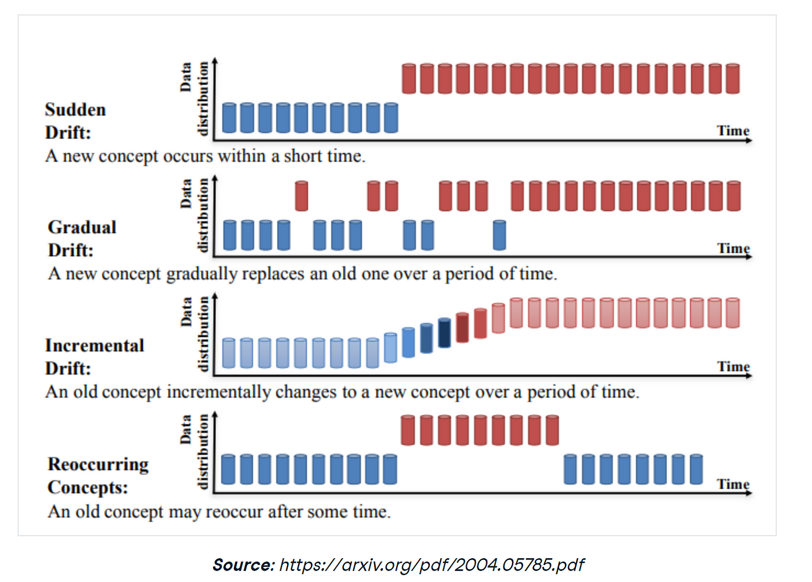
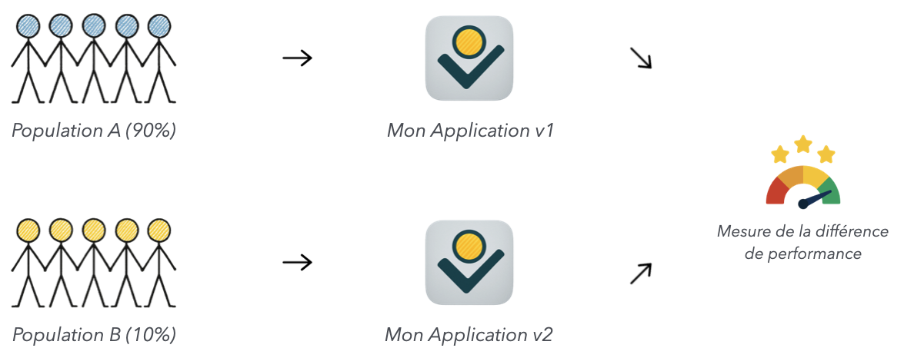
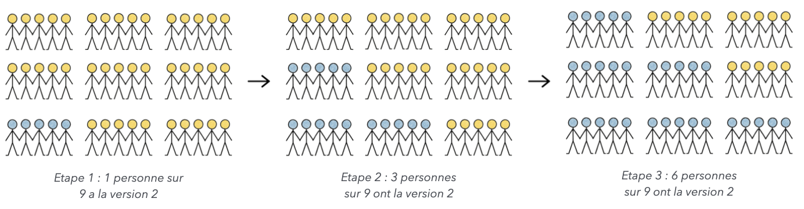
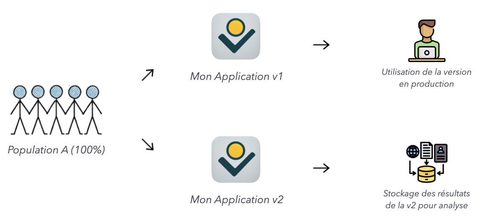
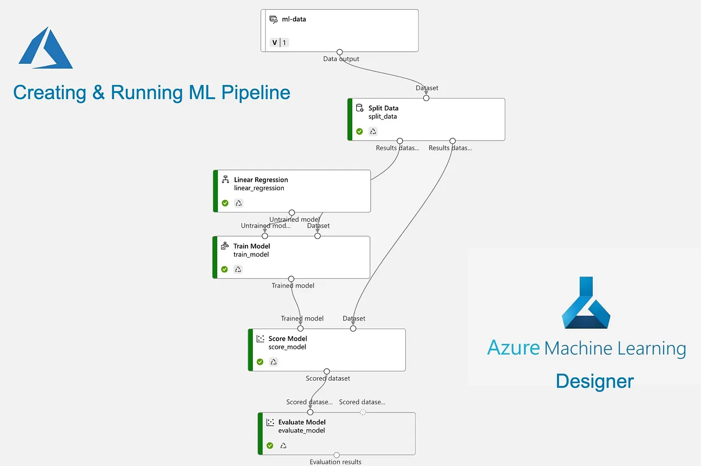

# 10. Quelques autres pratiques MLOps en vrac

Certaines bonnes pratiques en Machine Learning peuvent être mentionnées en vrac dans cette dernière section. Ce peut être des concepts importants, qui sont des questions à part entière d'entretien d'embauche et servir de bonne mesure en Data Science.

## Suivi d'applications en production (logging, kafka, data drift)

### Logging dans une application

Le logging dans une application (et de manière générale dans un code python) permet de créer des synthétiser et normaliser l'édition et l'affichage de message d'informations.

Génériquement, on sépare les messages de logging en catégorie selon les types : debug, info, warning, error, critical.

En pratique, les informations que l'on souhaite afficher et regrouper contiennnent la date, le fichier, ce qu'il s'est passé...

```python
>>> import logging

>>> logging.basicConfig(level=logging.DEBUG)
>>> logging.debug("This will get logged.")
DEBUG:root:This will get logged.
```

On peut exporter des logs dans des fichiers .log, ce qui permet d'historiser les logs dans des fichiers dédiés.

### Kafka 

Apache Kafka est une plateforme de streaming distribuée conçue pour gérer des flux massifs de données en temps réel. Elle est utilisée pour la collecte, le traitement, le stockage et la diffusion de données entre services ou microservices.

Kafka est une technologie un peu avancée, on peut toutefois se contenter de décrire les principaux jalons et concepts clés : 
- `Producer` : publie des messages dans un topic Kafka ;
- `Consumer` : lit les messages d’un topic ;
- `Topic` : catégorie ou canal où les messages sont envoyés ;
- `Broker` : serveur Kafka qui stocke et distribue les messages ;
- `Cluster` : ensemble de brokers Kafka ;
- `Partition` : sous-division d’un topic, permettant le parallélisme ;
- `Offset` : position d’un message dans une partition.

On peut s'en servir pour collecter des données et des informations, tels que des outputs de prédictions de modèles de machine learning. Cet outil peut aussi servir à mettre en place des systèmes de streaming d'information et / ou de données. Enfin, on peut s'en servir pour faire de l'ingestion de logs.

### Data Drift

On a rapidement évoqué le concept de datadrift précédemment.

Le Data Drift est un concept de Machine Learning qui consiste à constater un changement dans les données entre une période d'apprentissage et une période sur laquelle on souhaite faire de la surveillance.

Conceptuellement, on distingue plusieurs types de drift : 
- `label drift` : la distribution de la variable cible change alors que les variables prédictives ne changent pas ;
- `data drift` : une ou plusieurs variables prédictives d'un modèle changent alors que la target reste la même ; 
- `conceptual drift` : la relation entre les variables prédictives et les targets changent.

Après, le drift peut se dérouler et avoir lieu selon la temporalité suivante : 

<p align="center">
    
</p>

Le package "evidently" est un package python, très simple à utiliser, qui permet de faire un diagnostic rapide sur l'ensemble des data drifts présents dans des datasets.

## Tester la pertinence d'un modèle en conditions réelles

Pour tester un modèle en production, il existe des méthodes pour déployer un modèle en production et évaluer son impact, itérativement ou non :

- A/B testing : on sépare l'ensemble des utilisateurs en deux populations homogènes, et on envoie chacune des deux populations sur l'une ou l'autre version de l'applications.

<p align="center">
    
</p>

- Canary Testing : on déploie petit à petit la nouvelle version d'une application, en faisant augmenter progressivement le volume d'utilisateurs profitant de la nouvelle version.

<p align="center">
    
</p>

- Shadow Run : on déploie une version de la nouvelle application en parallèle de l'ancienne, en doublon, et on vérifie la performance de la nouvelle version avant de la passer en produciton.

<p align="center">
    
</p>

- Blue / Green deployment : on crée deux versions de l'environnement de production, et on déploie la nouvelle version sur le deuxième environnement en passant de la première à la deuxième.


## Pipeline d'entrainement automatique

Il est possible d'automatiser l'entrainement automatique de modèles de Machine Learning en click bouton. Cela permet d'être très rapidement prêt à avoir un nouveau modèle à déployer en production, avec les contraintes de modélisation déjà incluse dedans.

<p align="center">
    
</p>
<center><i>Un exemple de pipeline avec Azure ML...</i></center>